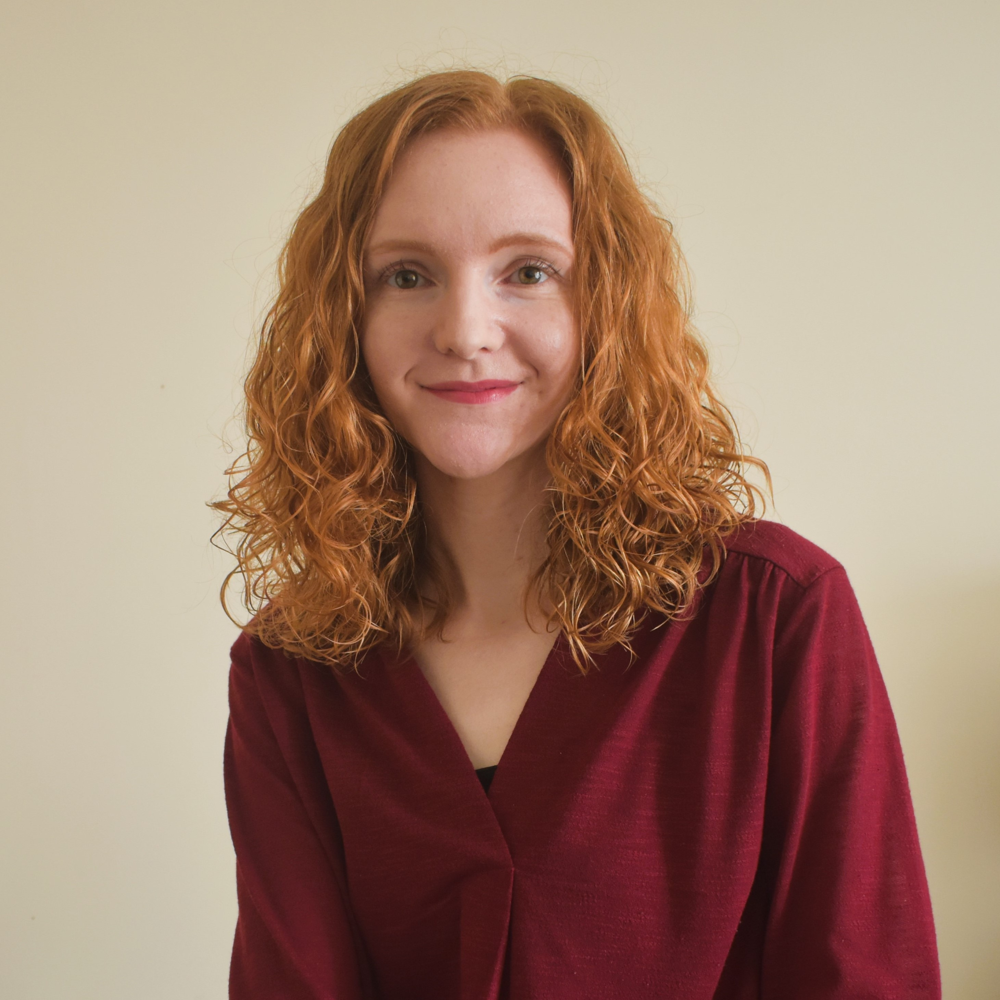

# RSS William Guy Lecture 2024-2025 (11-16 year olds)

## From lab to patient: how statistics shapes decisions in medicine

### Abstract

The decisions behind the medications we take are more complex than you might think. When we experience symptoms like a headache or earache, we might take over-the-counter medications or seek help from healthcare professionals. But have you ever wondered how they determine which medication to give you and how much? Before a treatment reaches your hands, many decisions are made regarding its safety and effectiveness. Statistics plays a key role in guiding these decisions. 

This talk will explore how statistics helps us to make informed choices in healthcare and medicine. I’ll discuss how researchers use statistical analysis to decide how many people are required to test a treatment in a clinical trial, to decide who those people should be, and to decide which people are allocated to which treatment. We’ll also talk about different ways we can measure how effective each treatment is, and evaluate whether it might be effective and safe for people it wasn’t tested on.  

In the talk, we’ll discuss concepts such as randomisation, control groups, and the difference between statistical and clinical significance in simple terms. You’ll see how these (sometimes complex) ideas stem from topics you might cover in school such as means, sample sizes, and correlations. This talk will highlight the role of statistics in helping healthcare professionals make decisions about treatments, dosages, and side effects. It will show how statistics helps us to make informed choices and understand the world around us better. By learning about statistics in medicine, we’ll see how useful statistics is in real life and how it impacts our health and well-being every day.

## Speaker

Nicola is a lecturer in health data science at Lancaster University. Nicola carries out research using healthcare data, including applying statistical and machine learning models to routinely collected data. She is especially interested in visualising data and understanding how we can better communicate statistics to general audiences. Nicola is particularly keen to show young people the broad variety of careers that statistics can lead them to and has delivered multiple talks to school students about using data to make the world better. She is keen to support women and minorities in their data science and programming journeys and organises local meetups to develop skills. 

## Images

* Scurvy: [www.rcpe.ac.uk/heritage/scurvy-college-collections](https://www.rcpe.ac.uk/heritage/scurvy-college-collections)

* BBC News: [www.bbc.co.uk/news/health-55056016](https://www.bbc.co.uk/news/health-55056016)

* Blood pressure cuff: [unsplash.com/photos/white-and-black-digital-device-i1iqQRLULlg](https://unsplash.com/photos/white-and-black-digital-device-i1iqQRLULlg)

## Further information

More information about the William Guy Lectures can be found at: [rss.org.uk/policy-campaigns/policy-groups/education-policy-advisory-group/rss-william-guy-lecturers](https://rss.org.uk/policy-campaigns/policy-groups/education-policy-advisory-group/rss-william-guy-lecturers/).
